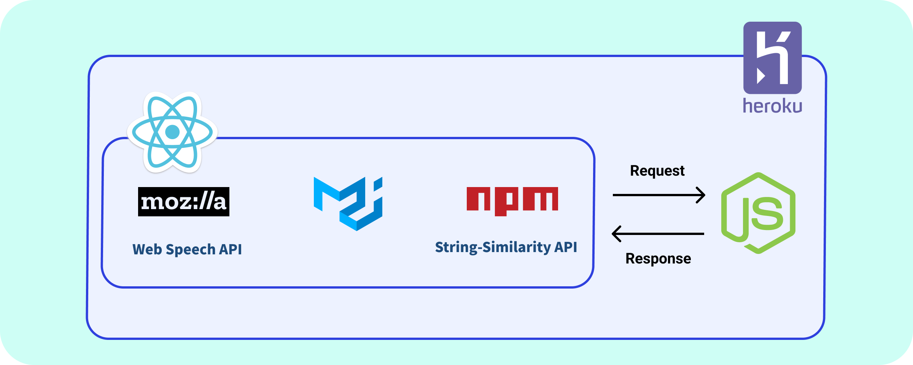

# Teleprompter-STT  

<a href="https://c11.kr/teleprompter-stt">
    
</a>

## Table of Contents
  - [프로젝트 소개](#-프로젝트-소개)
  - [주요 기능](#-주요-기능)
  - [System Architecture](#-system-architecture)
  - [Directory 구조](#-directory-구조)
  - [설치 방법](#keyboard-설치-방법)
  - [Reference](#-reference)
  - [License](#-license)
<br><br>

## 🎙 프로젝트 소개

<p align="center">
    
</p>
<br>

  - **음성에 맞춰 대본을 화면에 실시간으로 출력하는 프롬프터 서비스**
  - **Untact시대에 화상회의에서 편하게 발표할 수 있도록 도와주는 서비스**
<br><br>

## 📜 주요 기능
  - [**Web Speech API**](https://developer.mozilla.org/en-US/docs/Web/API/Web_Speech_API), [**String-Similarity API**](https://www.npmjs.com/package/string-similarity) 사용
  - Real-time Script Output
<br><br>

## 🏛 System Architecture

<p align="center">
    
</p>

<br><br>
## 🗂 Directory 구조
```bash
Teleprompter-STT
├── client                        ---> Front-end [React]
│   ├── public                    ---> 정적 파일 보관
│   │   ├── index.html
│   │   ├── manifest.json
│   │   └── robots.txt
│   ├── src
│   │   ├── components
│   │   │   └── Teleprompter.js   ---> 음성인식 && 문장유사도 수행 
│   │   ├── pages
│   │   │   ├── MainPage.js       ---> 메인 화면
│   │   │   └── PrompterPage.js   ---> 대본 출력 화면
│   │   ├── App.css
│   │   ├── App.js                ---> Router
│   │   ├── App.test.js
│   │   ├── index.css
│   │   ├── index.js
│   │   ├── reportWebVitals.js
│   │   ├── serviceWorker.js
│   │   ├── setupTests.js
│   │   └── styles.js             ---> PrompterPage.js Style
│   ├── .gitignore
│   ├── package-lock.json
│   └── package.json
│
├── .gitignore
├── LICENSE                       ---> MIT License
├── package-lock.json
├── package.json
├── README.md
└── server.js                     ---> Back-end [Node.js Express]
```
<br><br>

## :keyboard: 설치 방법
#### ☝️ React & Express 서버 동시 구동 (Local Server로 동작)

##### client 폴더 이동
`$ cd Teleprompter-STT/client`

##### React에 필요한 모듈 설치
`$ npm install`

##### Teleprompter-STT 폴더 이동
`$ cd ..`

##### Node.js에 필요한 모듈 설치
`$ npm install`

##### React & Express 서버 동시 시작
`$ npm run dev`

<br>

#### ✌️ Express 서버로만 구동 (Heroku로 배포 가능)

##### client 폴더 이동
`$ cd Teleprompter-STT/client`

##### React에 필요한 모듈 설치
`$ npm install`

##### Build File 생성
`$ npm run build`

##### Teleprompter-STT 폴더 이동
`$ cd ..`

##### Node.js에 필요한 모듈 설치
`$ npm install`

##### Express 서버 시작
`$ npm run server`
<br><br>

## 📋 Reference
- [**Web Speech API**](https://developer.mozilla.org/en-US/docs/Web/API/Web_Speech_API)
- [**String-Similarity API**](https://www.npmjs.com/package/string-similarity)
- [**Material-UI**](https://mui.com/)
<br><br>

## 📋 License
Teleprompter-STT is [MIT licensed](./LICENSE).

<br><br>
[👆Back To The Top](#teleprompter-stt)
